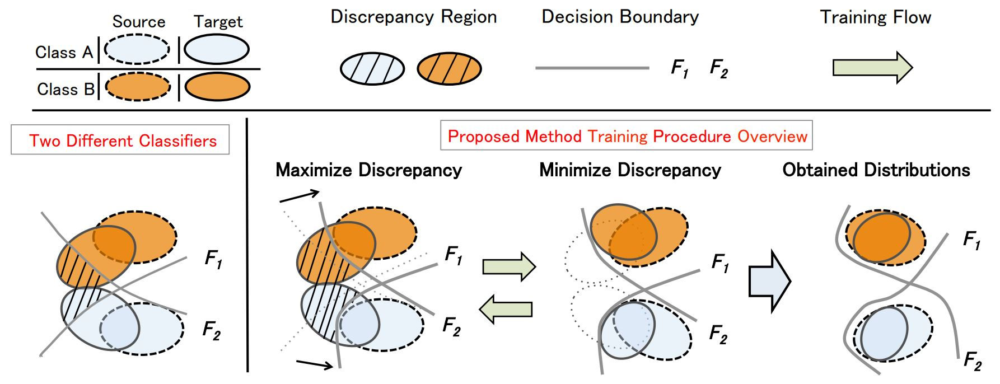

# Unsupervised Domain Adaptation 

Repository for the final project of the course "Machine Learning" at the University of Trento.

## Students:
- Evelyn Turri [GitHub](https://github.com/evelynturri)
- Andrea Bonomi [GitHub](https://github.com/bonom)

## Weights

All the weights of the best models we trained are available [here](https://drive.google.com/drive/folders/1YNAXZ96Deq58423yJ9ignHHTZMdbl33n?usp=share_link).

## Requirements

For this project the following packages are used:
 - Python 3.9
 - PyTorch 1.13.1 -> Referr to the [PyTorch website](https://pytorch.org) for the installation
 - Matplotlib 3.5.2 -> `pip install matplotlib==3.5.2`
 - Numpy 1.21.5 -> `pip install numpy==1.21.5`
 - Pandas 1.4.4 -> `pip install pandas==1.4.4`
 - Scikit-learn 1.0.2 -> `pip install scikit-learn==1.0.2`
 - Seaborn 0.11.2 -> `pip install seaborn==0.11.2`
 - Tqdm 4.64.1 -> `pip install tqdm==4.64.1`
 - Wandb 0.13.9 -> `pip install wandb==0.13.9`

## Introduction

In this notebook, we will explore the concept of **domain adaptation** and how it can be applied to improve the performance of machine learning models. In domain adaptation we aim at learning from a source data distribution a well performing model on a different (but related) target data distribution. This is particularly useful when we have limited labeled data in the target domain but a large amount of labeled data in the source domain.

We will start by discussing the problem of domain shift and how it can affect the performance of a model. Then, we will introduce different domain adaptation techniques such as feature alignment and adversarial training. We will also implement these techniques in PyTorch and evaluate their effectiveness on a real-world dataset.

## Goal

The goal is to implement an UDA technique for the problem of multiclass classification task with a suibset of the [Adaptiope](https://ieeexplore.ieee.org/document/9423412) dataset, consisting of images belonging to two different domains: Real Life and Product. The UDA technique can be chosen between:

 - Discrepancy-based methods
 - Adversarial-based methods
 - Reconstruction-based methods

As UDA method we present the **Maximum Classifier Discrepancy** (MCD) approach, a discrepancy-based one. This method is taken from the paper [Maximum Classifier Discrepancy for Unsupervised Domain Adapation](https://openaccess.thecvf.com/content_cvpr_2018/papers/Saito_Maximum_Classifier_Discrepancy_CVPR_2018_paper.pdf). And we will show the results obtained with this method and some possible improvements.

## Organization & Lineguides

Below we present the organization of the notebook and the lineguides that we followed during the project.

### Notations

- Source domain = domain from which we have the labeled data
- Target domain = domain to which we want to adapt our model (we have no labeled data)
- $P$ = Product domain
- $RW$ = Real World domain
- $P \rightarrow RW$ = Product to Real World: source domain is $P$ and target domain is $RW$
- $RW \rightarrow P$ = Real World to Product: source domain is $RW$ and target domain is $P$

### Dataset

Consider that datasets are split as following:

- Source domain = Product domain:
    - Train = $P_{train}$
    - Test = $P_{test}$
- Target domain = Real World domain:
    - Train = $RW_{train}$
    - Test = $RW_{test}$
  
### Tasks

Task that we accomplish, for both directions ( $P$ as source domain and $RW$ as target domain and viceversa):

1. *Baseline* 
    - Train the proposed model supervisedly on the source domain and evaluate it as it is on the target
    - Accuracy here is called $acc_{so}$ referred to the *source only* scenario
    - Finally, we compute the baseline in both directions: $P \rightarrow RW$ and $RW \rightarrow P$

2. *Upperbound* 
    - Train supervisedely on the target train set and test on the target test set
        - $P \rightarrow RW$ : train on $RW_{train}$ and test on $RW_{test}$
        - $RW \rightarrow P$ : train on $P_{train}$ and test on $P_{test}$

3. *Advanced* 
    - Simultaneously:
        - Train supervisedly on the source domain
        - Train unsupervisedly on the target domain applying the UDA component
    - Test on the target domain
    - Accuracy here is called $acc_{uda}$ referred to the *unsupervised domain adaptation* scenario  
    - Compute the gain: $G = acc_{uda} - acc_{so}$
  
        > Notice that $acc_{uda}$ should be bigger than $acc_{so}$ 

4. *Our proposals*
    - Try to improve the results of the advanced task with the help of some papers and ideas that we will present in the report
    - Compute the gain: $G = acc_{uda} - acc_{so}$
### Accuracies assignment

Minimum accuracy required for each task:

| Version | $P \rightarrow RW$ | $RW \rightarrow P$ |
| :---: | :---: | :---: |
| Source only | 76% | 90% |
| DA | 80% | 93% |

## Maximum Classifier Discrepancy

Paper available as [Maximum Classifier Discrepancy for Usupervised Domain Adapation](https://openaccess.thecvf.com/content_cvpr_2018/papers/Saito_Maximum_Classifier_Discrepancy_CVPR_2018_paper.pdf)

### Theoretical idea of the paper
The idea of the paper is to propose a way to align distributions of the source domain dataset and the target domain dataset by utilizig the task-specific decision boundaries. 
 
In the paper presents 3 main protagonists: 
- 1 generator: used to extract feaures from the inputs
- 2 discriminators: used for the classification part, since their role is to classify element given their features.

There are 2 goals and with the proposed method we are trying to reach both of them at the same time:
1. Maximize the discrepancy between 2 classifiers' outputs to detect target samples that are far from the support of the source.
2. Train the feature extractor in order to generate target features near the support to minimize the discrepancy.

    
    <figcaption align = "center"><b>Theoretical Idea of MCD Method</b></figcaption>

## Improvements

### Improvement 1: Supervised training on the features generator

In the paper of the previous approach, the authors were using three steps in the training, we recap them here:

- **Step A** : train in a superised way on the source domain the Feature Extractor and both Classifiers
- **Step B** : train in an unsupervised way on the target domain
    - Step B.1 : Fix the Generator and train in an unsupervised way the 2 Classifiers on the target domain
    - Step B.2 : Fix the Classifiers and train in an unsupervised way the Generator on the target domain

What we though was missing is a supervised training on the features generator, taking into account not only the two distinct predictions of the classifiers, but also a combined prediction of the two.

After step B we propose to add another step, we call it **Step C**, in which we will do the following procedure:
- Extract the features from an image of the source domain
- Compute the predictions with the classifier of the source domain and the classifier of the target domain, respectively called `out_source_s` and `out_target_s`
- Compute the combined prediction : `out = out_source_s + out_target_s`
- Compute the CrossEntropy Loss between the combined output and the respectively label of the source domain
- Update weights of the Features Extractor with the Loss just computed

For this improvement the only function we modifiy is the `train_mcd_one_step()` in which we add **Step C**. For the test and the loop training functions we keep the same of the MCD method. 

### Improvement 2 : Loss function

In the previous improvement we have seen that the accuracy of the model is improved, but the loss is not much different. We think that the loss is not improved because the loss function is not the best one for this task. 

In the paper of the MCD method the authors are using the CrossEntropy loss. However, we thought about a better way to compute the loss, which we took from [CDA: Contrastive-adversarial Domain Adaptation](https://arxiv.org/abs/2301.03826).

They propose a loss function which is a combination of a two-stage loss that corresponds to the supervised and unsupervised steps. The loss function is defined as:
 - **Stage 1** : the loss is as a sum of the CrossEntropy loss and a Supervised Contrastive Loss. The Supervised Contrastive Loss ($L_{SupCL}$) is computed as:
   $$L_{SupCL}(X_s, Y_s) = - \sum_{z, z^+ \in D_s} \log \frac{\exp (z^T z^+ / \tau)}{\exp (z^T z^+ / \tau) + \sum_{z^- \in D_s} \exp (z^T z^- / \tau)}$$
   where variable $z_s$ denote the $l_2$ normalized latent embedding generated by $G$ (feature generator) corresponding to the input sample $x_s$. $D_s$ is the source domain while the target domain is $D_t$. The variable $\tau$ refers to the temperature scaling (hyperparameter set to `0.1` as default) which affects how the model learns from hard negatives.
 - **Stage 2** : the loss is a cross-domain contrastive loss:
   $$L_{CrossCL}(X_s, Y_s, X_t) = - \sum_{i = 1 ;\ z_s \in D_s ;\ z_t \in D_t}^N \log \frac{\exp ({z_s^i}^T z^i_t / \tau)}{\exp ({z_s^i}^T z^i_t / \tau) + \sum_{i \neq k = 1}^{N} \exp ({z_s^i}^T z^k_t / \tau)}$$

However, we have not been able to implement the second stage of loss function because they assume that the target domain has some form of pseudo-labels. The authors propose to use *k*-means clustering to generate pseudo-labels for the target domain. We did not use it since we can not use labels for the target domain.

Thus, the loss function at **stage 2** is implemented as the MCD loss function: CrossEntropy - Discrepancy.

## Final discussion

In this project we have implemented the MCD method and we have tried to improve it. 

We started from a baseline that was pretty good (80.7% for the $P \rightarrow RW$ direction and 92.2% for the $RW \rightarrow P$ direction). But we had the margin to improve it since the upperbounds were 9.5% and 5.1% better than the baseline. 

With the MCD method we have obtained a good accuracy, with the $P \rightarrow RW$ direction we have obtained an accuracy of 88.0% with some margin for other improvements (2.5%) while with the $RW \rightarrow P$ direction we have obtained an accuracy of 96.5% with very little margin for improvements (0.8%).

We tried to improve the MCD method with an idea that we had and then by changing the loss function with the one proposed in [CDA: Contrastive-adversarial Domain Adaptation](https://arxiv.org/abs/2301.03826). With the first of the two improvements we have obtained a better accuracy for the $P \rightarrow RW$ direction, while with the second one we have not obtained any improvement, it even got worse.

The overall results are reported in the table below:

| Direction | Stage | Accuracy |
| :---: | :---: | :---: |
| $P \rightarrow RW$ | Baseline | 80.7% |
| $P \rightarrow RW$ | MCD | 88.0 % |
| $P \rightarrow RW$ | Improvement 1 | 89.0% |
| $P \rightarrow RW$ | Upper bound | 90.5% |
| | | |
| $RW \rightarrow P$ | Baseline | 92.2% |
| $RW \rightarrow P$ | MCD | 96.5% |
| $RW \rightarrow P$ | Improvement 1 | 95.8% |
| $RW \rightarrow P$ | Upper bound | 97.3% |

## Conclusions

In conclusion, we have implemented the MCD method and we have tried to improve it. We have obtained very good results both on $P \rightarrow RW$ direction and $RW \rightarrow P$. The proposed idea, improved only the result for the first direction, while for the second one reached somehow the same accuracy, without bringing any improvement. 

Finally we can say that MCD works already very well, the proposed idea is a plus, especially for those cases that are more difficult to work with.

